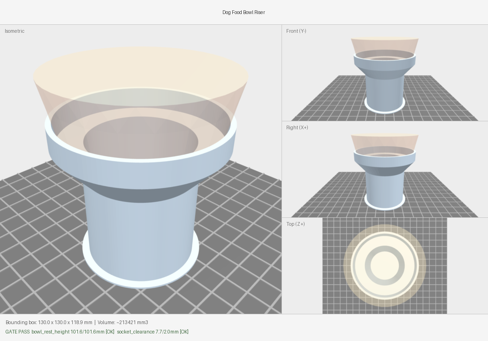
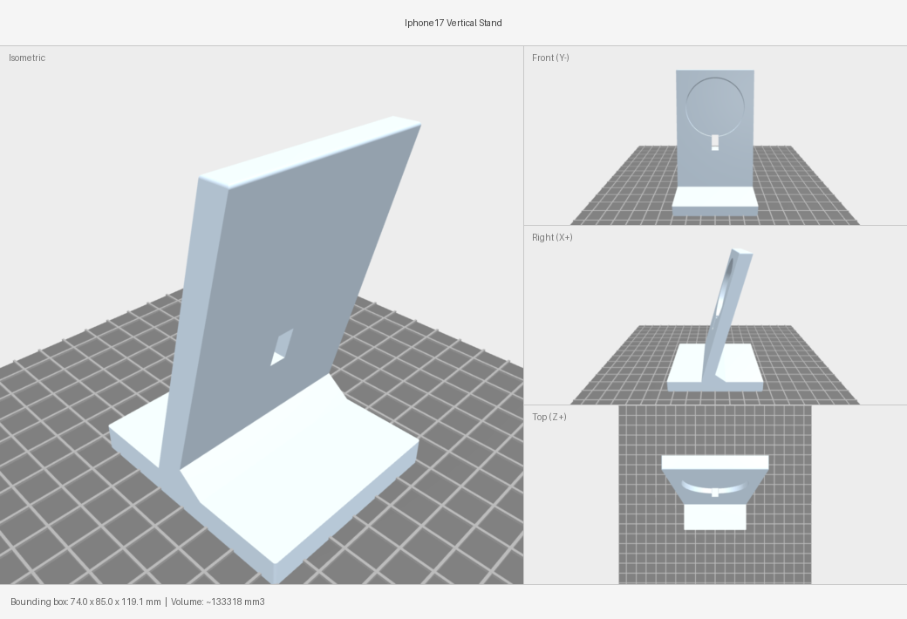
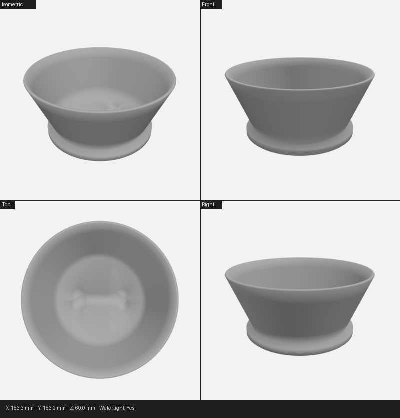
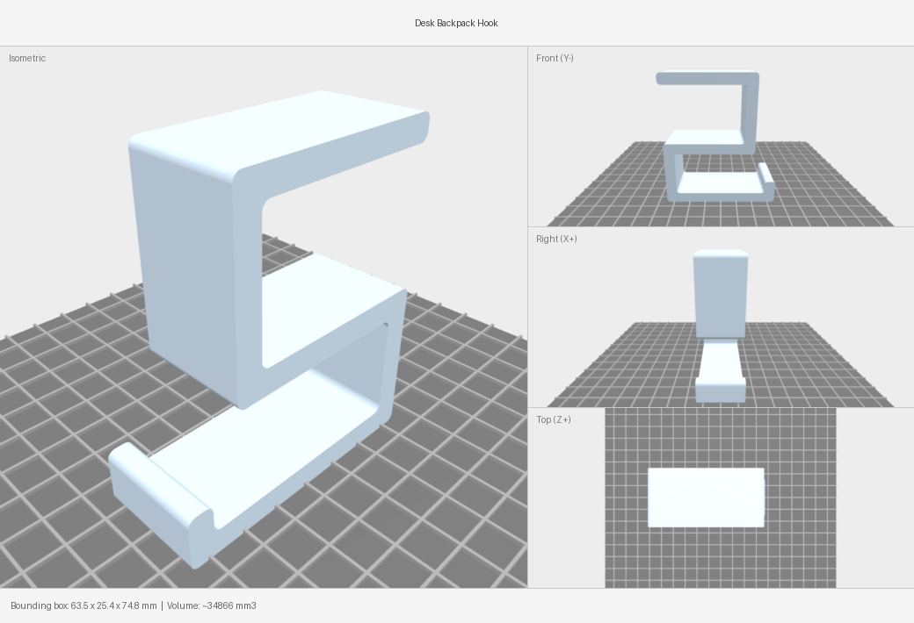

# 🔨 partsmith

**Describe a physical object in plain English → get a printable, dimensionally-verified STL.**

*Conversational CAD that forges real parts — and verifies they actually fit before they print.*

partsmith is a CAD pipeline built on [CadQuery](https://cadquery.readthedocs.io/). You talk through what you want; it gathers a spec, sources real-world dimensions, generates a parametric model, and — the part that makes it actually useful — **runs a numeric gate that catches functionally-wrong parts before they ever reach the printer.**



<sub>*The translucent amber bowl is a **proxy** of the mating part, dropped into the socket. The footer reads `GATE PASS — bowl_rest_height 101.6/101.6mm` — the design is verified in its assembled state, not just as a lone part.*</sub>

---

## Why this exists

Generative CAD is great until you print a part and discover it's *subtly wrong*. Two real failures from this project drove the design:

- 🦴 **A dog-bowl riser** was supposed to put the bowl "4 inches above the ground." It shipped with the bowl resting at **4.48 inches** — because "4 inches" was never pinned to an actual *from→to* measurement, and the riser was modeled **without the bowl**, so the number that mattered was never computed.
- 📱 **A phone stand** burned **11 revisions** nudging dimensions one at a time — MagSafe air-gap, cable fit, tipping — because the fit math was never done up front.

The fix is a guardrail system with three ideas:

| Idea | What it does |
|------|--------------|
| **🎯 Datum capture** | Every fuzzy measurement ("4 inches above the ground") is rewritten as an explicit `from → to` with a value + tolerance. No more guessing which point the number refers to. |
| **🧩 Assembled-state proxies** | The model is built *with* a proxy of the thing it mates with (bowl, phone, connector), so the functional dimension is actually measured. |
| **✅ Numeric gate** | A spec-driven check compares the model's measured values to the spec and returns **PASS/FAIL** — wrong dimensions can't pass review. |

---

## 📋 Human-readable specs

Every object starts as a small JSON spec. It reads like a design brief.

**A spec that fits a real product** (`outputs/iphone17_vertical_stand/intent_spec.json`):

```jsonc
{
  "object": "iPhone 17 phone stand",
  "purpose": "Hold iPhone 17 vertically on a desk while charging via MagSafe",
  "material": "Marble PLA",
  "printer": "Prusa MK4",
  "constraints": [
    "Phone sits vertically (portrait orientation)",
    "MagSafe puck slot centered in the back panel",
    "~15 degree rearward tilt for stability"
  ],
  "dimensions_known": {
    "iphone17_width_mm": 71.5,
    "magsafe_puck_diameter_mm": 56.0,
    "magsafe_puck_thickness_mm": 5.6,   // recess must be < this, or the magnets pull across an air gap
    "tilt_angle_deg": 15
  }
}
```

**The headline feature — `critical_measurements` with explicit datums.** This is what makes a fuzzy request precise:

```jsonc
{
  "object": "dog food bowl riser",
  "interaction_model": "drops-in",          // bowl drops INTO a socket (vs sits-on / clips-on)
  "critical_measurements": [
    {
      "name": "bowl_rest_height",
      "from": "print bed (z=0)",
      "to":   "underside of bowl where it rests on the socket floor",
      "value_mm": 101.6, "tolerance_mm": 3.0, "comparison": "eq",
      "source": "user: 'make the bowl sit 4 inches above the ground'"
    },
    {
      "name": "socket_clearance",
      "from": "socket bore wall", "to": "bowl outer wall (diametral)",
      "value_mm": 2.0, "comparison": "min"   // the bowl must drop in with room to spare
    }
  ]
}
```

> **Read it in English:** *"The bowl drops into a socket. The bottom of the bowl must sit 101.6 mm (4.0 in) above the bed, ±3 mm. The socket must be at least 2 mm wider than the bowl so it actually drops in."* Every one of those lines becomes an automated PASS/FAIL check.

---

## ✅ The gate in action

Each generated model prints a single machine-readable line of what it actually built, e.g.
`MEASUREMENTS_JSON: {"bowl_rest_height": 113.9, "socket_clearance": 7.7}`.
The gate compares it to the spec:

```text
SPEC VERIFICATION (critical measurements)
============================================================
[FAIL] bowl_rest_height
        from print bed (z=0) -> underside of bowl where it rests on the socket floor
        target 101.6 mm (4.00 in)  +/- 3.0 mm
        actual 113.9 mm (4.48 in)  (delta +12.3 mm)   ← the exact bug that shipped before
[PASS] socket_clearance
        target >= 2.0 mm
        actual 7.7 mm  (delta +5.7 mm)
------------------------------------------------------------
1/2 passed  (1 need fixing)
```

Fix the geometry, re-run, and it flips to `2/2 passed — ALL PASS`. No human has to *notice* the bowl is too high.

---

## 🖼️ Gallery

| | |
|---|---|
|  |  |
| **iPhone 17 MagSafe stand** — recessed puck (sits proud by 0.6 mm so it actually grabs), cable slot, 15° tilt. | **Dog water bowl** — tapered frustum, bone engraved into the flat floor (curved-surface engraving is a known trap). |
|  |  |
| **Desk-edge gravity hook** — folded-ribbon profile that locks under load, prints on its side with zero supports. | **Bowl riser** — verified in its assembled state with a proxy bowl. |

Every preview is multi-view (isometric + front/right/top) with the bounding box and measured values in the footer, rendered headlessly via `pyrender`.

---

## 🚀 Quickstart

```bash
# CadQuery needs Python 3.10–3.12 (OCC kernel lacks 3.13+ wheels)
python3.12 -m venv .venv && source .venv/bin/activate
pip install -r requirements.txt

# Build a model + render the assembled preview + run the numeric gate in one command:
.venv/bin/python3 run_cadquery_model.py outputs/<slug>/v<N>/model.py \
    --preview --strict --spec outputs/<slug>/intent_spec.json
```

The runner emits a JSON result with `success`, `watertight`, `measurements`, and `gate` (`gate.passed` + per-measurement PASS/FAIL). Re-check any model without rebuilding:

```bash
.venv/bin/python3 verify_spec.py outputs/<slug>/intent_spec.json --run outputs/<slug>/v<N>/model.py
```

This project is designed to be driven conversationally inside [Claude Code](https://claude.com/claude-code) — the full step-by-step workflow lives in [CLAUDE.md](CLAUDE.md).

---

## 🧰 Key files

| File | Purpose |
|------|---------|
| [CLAUDE.md](CLAUDE.md) | The end-to-end workflow (intent → references → design brief → generate → review → deliver) |
| [skills/cad_skill.md](skills/cad_skill.md) | CadQuery patterns, the script template, and the mandatory verification block |
| [skills/design-review.md](skills/design-review.md) | Printability + assembled-state review checklist |
| [skills/mating_proxies.py](skills/mating_proxies.py) | Bowl / phone / box proxies + fit helpers (`clearance`, `puck_protrusion`, `combine_cog`) |
| [verify_spec.py](verify_spec.py) | The numeric gate — measured values vs spec `critical_measurements` |
| [run_cadquery_model.py](run_cadquery_model.py) | Runs a model, renders the preview, runs the gate, returns JSON |
| [preview.py](preview.py) | Multi-view renderer with translucent mating part + measurement footer |
| `outputs/design_lessons.json` | Pattern-keyed lessons carried across sessions |

---

## 🧪 Tests

The guardrail tooling has dependency-free regression tests:

```bash
.venv/bin/python3 tests/test_guardrails.py
```

---

## License

MIT — see [LICENSE](LICENSE).
